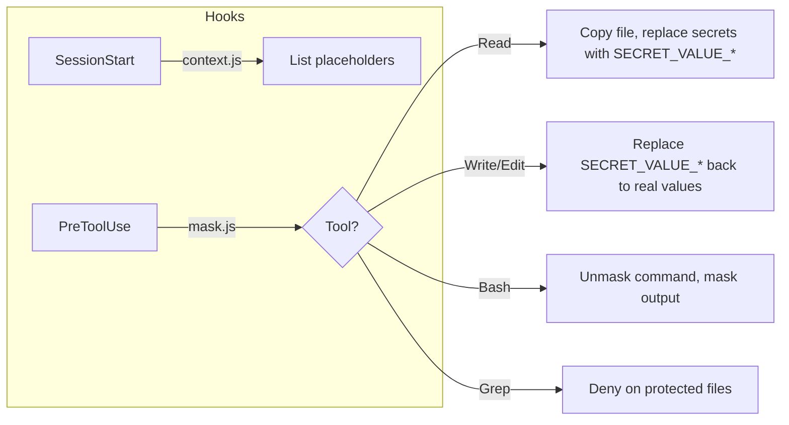

<h1 align="center">secret-mask</h1>

<p align="center">
  <strong>Keep secrets out of Claude Code's context.</strong><br/>
  Real files stay untouched - masking only happens in the hook layer.
</p>

<p align="center">
  <a href="hooks/hooks.json"></a>
  <a href="https://nodejs.org"></a>
  <a href="LICENSE"></a>
</p>

## How it works



Claude sees `SECRET_VALUE_API_KEY` instead of `sk-live-abc123`. When it writes or executes, placeholders are swapped back silently.

## Install

```bash
claude plugin add enixCode/secret-mask
```

## Setup

1. In your target project, create `.secretmask/config.json`:

**Simple (KEY=VALUE files like .env):**
```json
{
  ".env": [".*KEY.*", ".*SECRET.*", ".*TOKEN.*", ".*PASSWORD.*"]
}
```

**Advanced (custom file formats - JSON, YAML, INI...):**
```json
{
  "credentials.json": {
    "patterns": [".*key.*", ".*secret.*"],
    "extractor": "^\\s*\"([^\"]+)\"\\s*:\\s*\"([^\"]+)\"\\s*,?\\s*$"
  }
}
```

- Simple: array of regex patterns matching key names. Default extractor: `KEY=VALUE`
- Advanced: object with `patterns` (same) + `extractor` (regex with 2 capture groups: key, value)
- Both syntaxes can be mixed. See `config.example.json` for more examples.

2. Start Claude Code in that project - the plugin activates automatically.

## Dependencies

- node

## License

MIT
